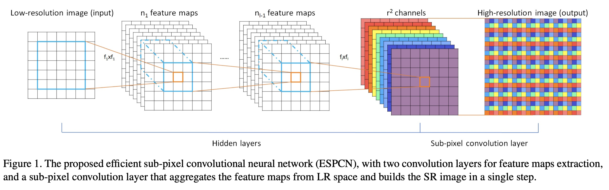
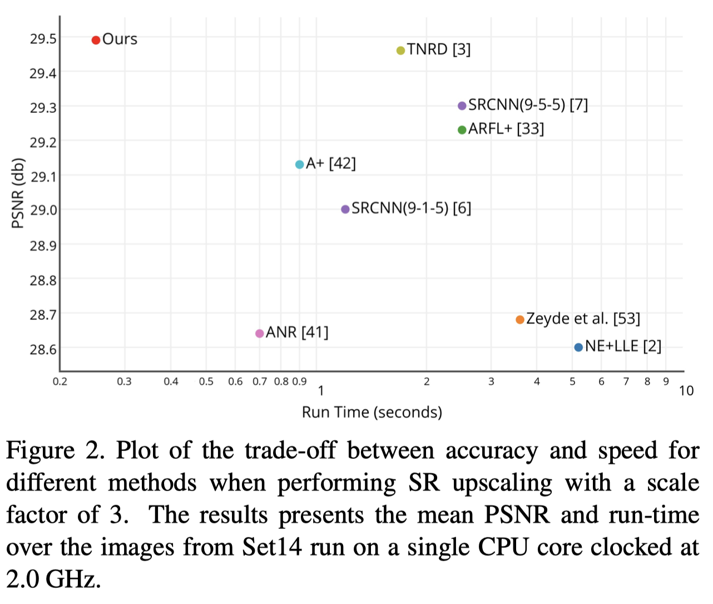
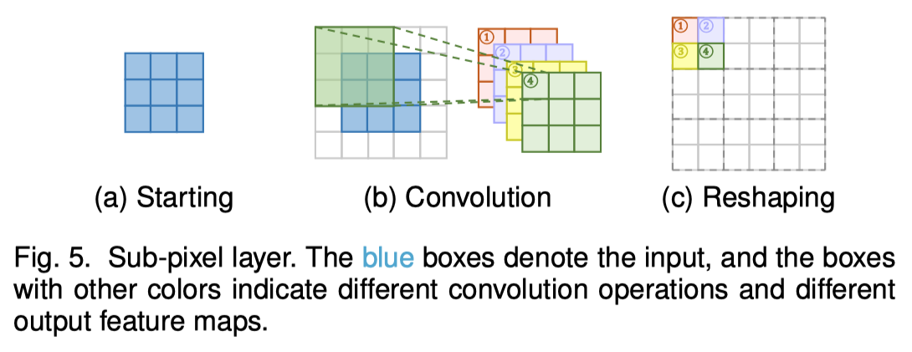

[Standford Compression Forum](<https://compression.stanford.edu/>)

## Transposed Convolution

[Zhihu Link](<https://www.zhihu.com/question/43609045?sort=created>)

[CSDN](<https://blog.csdn.net/u014722627/article/details/60574260#fn:1>)

[A guide to receptive field arithmetic for Convolutional Neural Networks](<https://medium.com/mlreview/a-guide-to-receptive-field-arithmetic-for-convolutional-neural-networks-e0f514068807>)

**A guide to convolution arithmetic for deep learning**

[Up-sampling with Transposed Convolution](<https://towardsdatascience.com/up-sampling-with-transposed-convolution-9ae4f2df52d0>) with example and code

[github](<https://github.com/Easoncyx/deep-learning>)

[Deconvolution and Checkerboard Artifacts](<https://distill.pub/2016/deconv-checkerboard/>)

[Transposed Convolutions explained with… MS Excel!](<https://medium.com/apache-mxnet/transposed-convolutions-explained-with-ms-excel-52d13030c7e8>)

The Transposed Convolution has nothing to do with the inverse process of convolution. It's just another way to do the upscaling using the filter that can be learned from data.

##关于卷积操作

[链接](https://www.zhihu.com/question/27251882/answer/35942373)

对于图像而言，离散卷积的计算过程是模板翻转，然后在原图像上滑动模板，把对应位置上的元素相乘后加起来，得到最终的结果。如果不考虑翻转，这个滑动-相乘-叠加的过程就是相关操作。事实上我也一直用相关来理解卷积。在时域内可以从两个角度来理解这样做的含义。

一种是滤波，比如最简单的高斯模板，就是把模板内像素乘以不同的权值然后加起来作为模板的中心像素值，如果模板取值全为1，就是滑动平均；如果模板取值为高斯，就是加权滑动平均，权重是中间高，四周低，在频率上理解就是低通滤波器；如果模板取值为一些边缘检测的模板，结果就是模板左边的像素减右边的像素，或者右边的减左边的，得到的就是图像梯度，方向不同代表不同方向的边缘；

另一种理解是投影，因为当前模板内部图像和模板的相乘累加操作就是图像局部patch和模板的内积操作，如果把patch和模板拉直，拉直的向量看成是向量空间中的向量，那么这个过程就是patch向模板方向上的投影，一幅图像和一个模板卷积，得到的结果就是图像各个patch在这个方向上的response map或者feature map；如果这样的模板有一组，我们可以把这一组看成一组基，得到的一组feature map就是原图像在这组基上的投影。常见的如用一组Garbor滤波器提取图像的特征，以及卷积神经网络中的第一层，图像在各个卷积核上的投影。

[关于图像卷积](<https://zhuanlan.zhihu.com/p/28478034>)

# ESPCN

ConvNet + Sub-pixel Layer

Post-upsampling SR

# Dataset

## Video

[Video Dataset Overview](<https://www.di.ens.fr/~miech/datasetviz/>)

[Xiph](<https://media.xiph.org/video/derf/>) SD, HD, 4K

[Ultra Video Group](<http://ultravideo.cs.tut.fi/#testsequences>)  7 videos, 1080p

[CDVL](<https://www.cdvl.org/find-videos/index.php>) 

115 uncompressed full HD videos, 30 random samples are extracted from
each HR-LR video pair to obtain 3000 training samples

[vid4]()

walk, city, calendar and foliage, and has sizes 720 × 480 or 720 × 576.

[youtube 8M](<https://research.google.com/youtube8m/download.html>)

May 2018 version (current): 6.1M videos, 3862 classes, 3.0 labels/video, 2.6B audio-visual features

[YouTube-BoundingBoxes Dataset](<https://research.google.com/youtube-bb/>)

The data set consists of approximately 380,000 15-20s video segments extracted from 240,000 different publicly visible YouTube videos, automatically selected to feature objects in natural settings without editing or post-processing, with a recording quality often akin to that of a hand-held cell phone camera.